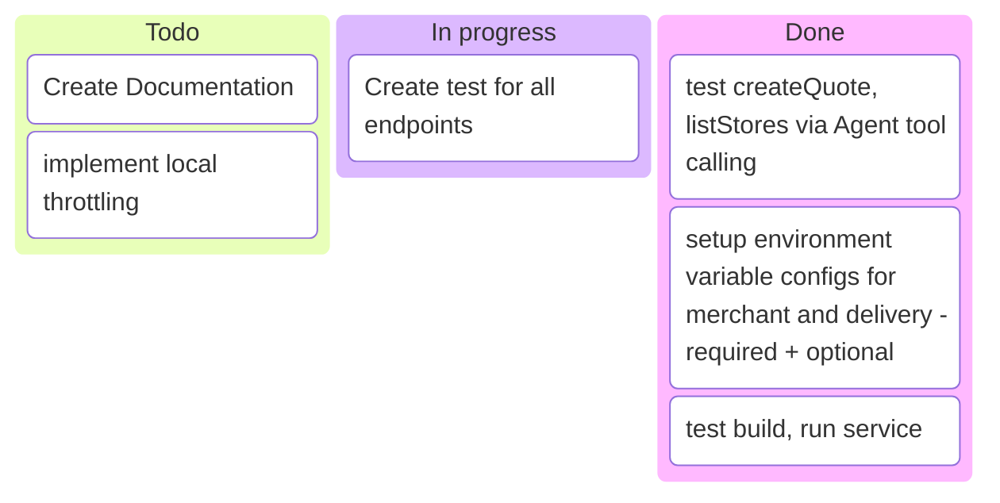

# 🧠 DoorDash-Driver Tool Server

A plug-and-play server for the DoorDash-Driver API using FastAPI.  

## 🚀 Quickstart

Clone the repo, set up the .env vars and start the Server

```bash
git clone https://github.com/entitycs/doordash-driver-fastapi
docker compose up
```

That's it – you're live! 🟢

Default port: 8099 - modify it in compose.yaml

[detail]

# Required Config

See config module sample.env files for environment variable settings
| <h2>Config Type</h2> | <h2>Defines</h2> |
|--------------------|--------------------|
| <h3>🔩 **Internal Config**</h3> <br/> Developer Client (aka business) information | <h3> <br/> - [x]  Developer ID <br/> - [x] Key ID<br/> - [x] Signing Secret</h3>|
| <h3>🏪**Merchant Config**</h3> <br/> Company + Store Information| <h3><br/>  - [x] Pickup External Business ID<br/>  - [x] Pickup External Store ID<br/>  - [x] Pickup Address<br/>  - [x] Pickup Phone Number </h3> |

# Constrains

Soft limits can be expanded through app updates.  

- 25 Stores (soft limit)
- todo:



