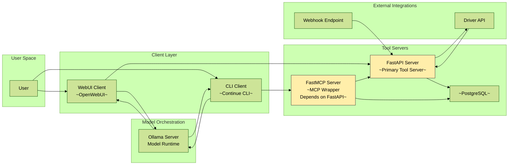

# Context : Overview

```mermaid
---
config:
  theme: forest
---

flowchart LR

    subgraph UserSpace[User Space]
        U[User]
    end

    subgraph ClientLayer[Client Layer]
        W[WebUI Client<br/>~OpenWebUI~]
        C[CLI Client<br/>~Continue CLI~]
    end

    subgraph Orchestration[Model Orchestration]
        O[Ollama Server<br/>Model Runtime]
    end

    subgraph Tooling[Tool Servers]
        A[FastAPI Server<br/>~Primary Tool Server~]:::servers
        M[FastMCP Server<br/>~MCP Wrapper<br/>Depends on FastAPI~]:::servers
        DB[~PostgreSQL~]
    end

    subgraph External[External Integrations]
        D[Driver API]
        H[Webhook Endpoint]
    end

    %% User entry
    U --> W
    U --> C

    %% Clients to orchestrator
    W --> O
    C --> O

    %% Orchestrator to tool servers
    O --> W
    O --> C

    %% Client routing
    W --> A
    C --> M

    %% Dependency direction
    M --> A

    %% Tool server interactions
    A --> DB
    M --> DB
    A --> D
    D --> A
    H --> A

    classDef servers fill:#fea,color:#000,stroke:#333;


```