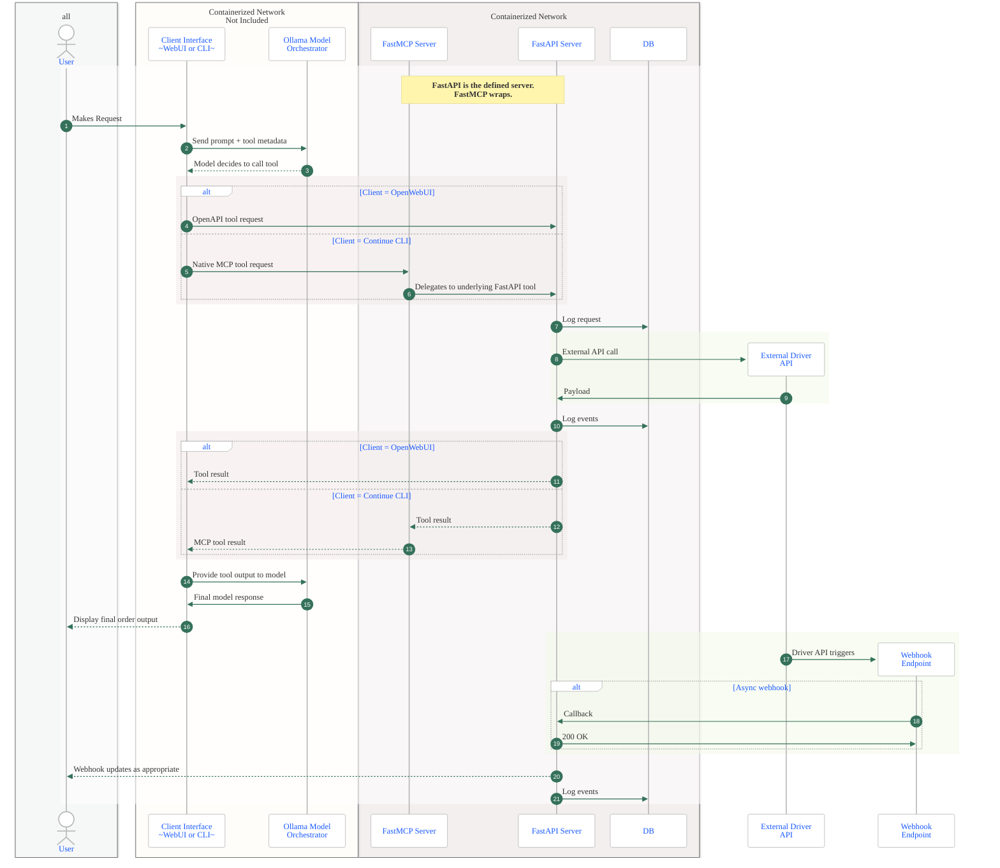

# Context : Sequence

```mermaid
---
  config:
    theme: base
    themeVariables:
      primaryColor: "#647871"
      background: "#e2e3e3"
      secondaryColor: "#ede7df"
      tertiaryColor: "#a98e92"
      lineColor: "#969f9c"
      signalColor: "#35715bff"
      sequenceNumberColor: "#ffffffff"
      actorBkg: "rgba(255, 255, 255, 1)"
      actorTextColor: "rgba(24, 89, 255, 1)"
      actorBorder: "rgba(182, 182, 182, 1)"
      mainBkg: "#3C352C"
      fontFamily: Trebuchet MS, Verdana, Arial, Sans-Serif
      noteFontWeight: 800
    sequence:
      actorMargin: 30
      labelBoxWidth: 100
      mirrorActors: true
      messageAlign: left
---

sequenceDiagram
    autonumber
    rect rgba(255, 255, 255, 0.55)
    box rgba(246, 247, 247, 1) all
        actor User as User
    end

    box rgba(255, 253, 250, 1) Containerized Network<br/>Not Included
        participant Client as Client Interface<br />~WebUI or CLI~
        participant Orchestrator as Ollama Model<br />Orchestrator
    end 
    box rgba(243, 239, 239, 1) Containerized Network
        participant FastMCP as FastMCP Server
        participant FastAPI as FastAPI Server
        participant DB
    end
    
    Note over FastAPI, FastMCP: FastAPI is the defined server.<br/>FastMCP wraps.

    User->>Client: Makes Request
    Client->>Orchestrator: Send prompt + tool metadata
    Orchestrator-->>Client: Model decides to call tool

    %% alt Tool call triggered
        %% Client routing logic
    rect rgba(242, 236, 236, 0.55) 
        alt Client = OpenWebUI
            Client->>FastAPI: OpenAPI tool request
        else Client = Continue CLI
            Client->>FastMCP: Native MCP tool request
            FastMCP->>FastAPI: Delegates to underlying FastAPI tool
        end
    end
        FastAPI->>DB: Log request

        %% External API
        rect rgba(242, 249, 232, 0.55) 
          create participant DriverAPI as External Driver<br />API
          FastAPI->>DriverAPI: External API call
          DriverAPI->>FastAPI: Payload
        end

        FastAPI->>DB: Log events

        %% Return path
    rect rgba(242, 236, 236, 0.55) 
        alt Client = OpenWebUI
            FastAPI-->>Client: Tool result
        else Client = Continue CLI
            FastAPI-->>FastMCP: Tool result
            FastMCP-->>Client: MCP tool result
        end
    end
        Client->>Orchestrator: Provide tool output to model
        Orchestrator->>Client: Final model response
    %% end

    Client-->>User: Display final order output
    rect rgba(242, 249, 232, 0.55) 
      create participant Webhook as Webhook<br />Endpoint
      DriverAPI->>Webhook: Driver API triggers

      alt Async webhook
          Webhook->>FastAPI: Callback
          FastAPI->>Webhook: 200 OK
      end
    end
    FastAPI-->>User: Webhook updates as appropriate
    FastAPI->>DB: Log events
end
```

## Usage Contexts
### OpenWebUI

