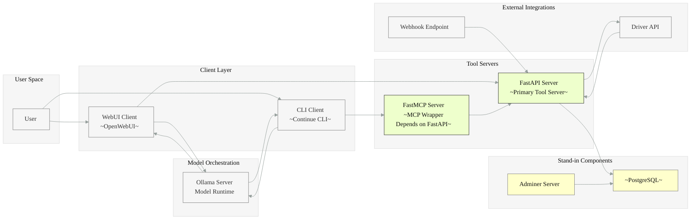

# Usage Contexts

<details>
<summary>
Architectural Context Overview
</summary>
    
### Repo Scope

Included in this repo scope are OpenAPI + MCP Tool servers.  This includes two-way communication between the user and the Doordash Driver API, including Webhooks.

Storage and Administrative tools are placeholders only - There are no plans to build these components robustly.

You can use curl, Postman, and the included '/docs' endpoints to test the Tooling servers directly.  Provided below are example contexts and configurations which represent just a few of the contexts for which the tool servers can be configured.
    


</details>

## Client Layer

<details>
<summary>
Usage Contexts : WebUI Agent Tool
</summary>

### Example configuration for Ollama + OpenWebUI (shared container network)
Note: When using ollama as a container, don't forget to update the image alongside updating ollama itself

```yaml
services:
  ollama:
    image: ollama/ollama:latest
    container_name: ollama
    restart: unless-stopped
    volumes:
      #- change to your root ollama model path if it differs
      - /usr/share/ollama/.ollama/models:/root/.ollama/models:ro
      - ollama-data:/root/.ollama
    networks:
      - mynet
    ports:
      - "11434:11434"
    environment:
      - NVIDIA_VISIBLE_DEVICES=all
      - NVIDIA_DRIVER_CAPABILITIES=compute,utility
    runtime: nvidia   # optional on Desktop

  open-webui:
    image: ghcr.io/open-webui/open-webui:cuda
    container_name: open-webui
    restart: unless-stopped
    depends_on:
      - ollama
    environment:
      OLLAMA_BASE_URL: http://ollama:11434
      NVIDIA_VISIBLE_DEVICES: all
      NVIDIA_DRIVER_CAPABILITIES: compute,utility
    ports:
      - "8080:8080"
    volumes:
      - test-open-webui:/app/backend/data
      # - /mnt/e/your/workspace/src:/workspace/src
    networks:
      - mynet
    runtime: nvidia   # optional on Desktop

volumes:
  ollama-data:
  test-open-webui:
    external: true
    name: test-open-webui

networks:
  mynet:
    driver: bridge

```

</details>


<details>
<summary>Usage Contexts: Continue CLI</summary>
    
### Example configuration for Continue CLI (http vs websocket)
Note: mcp server configured as http for ease of testing/development. Recommended: use websocket in production
    
```yaml
    name: Local Assistant
    version: 1.1.0
    schema: v1
    
    models:
      - name: Autodetect
        provider: ollama
        model: AUTODETECT
        roles:
          - chat
          - edit
          - apply
          - rerank
          - autocomplete
      - name: NemoTooling
        provider: openai
        model: nemo-tooling
        env:
          useLegacyCompletionsEndpoint: false
        apiBase: http://localhost:8080/api
        apiKey: sk-223eed9cfed54f3f8345bc26bf6c8ff4
        roles:
          - chat
          - edit
        context:
        - provider: code
        - provider: docs
        - provider: diff
        - provider: terminal
        - provider: problems
        - provider: folder
        - provider: codebase
    mcpServers:
      - name: GrepSearch
        type: streamable-http
        url: http://localhost:8081/mcp
      - name: MermaidBulkDiagram
        type: streamable-http
        url: http://localhost:8085/mcp
      - name: DoorDashDriver
        type: streamable-http
        url: http://localhost:8199/mcp
  
```
</details>