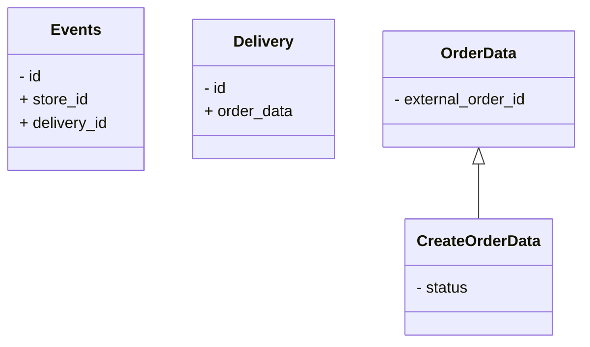

# Storage

A simple postgres implementation is provided to build from

```mermaid
classDiagram

class Events {
 - id
 + store_id
 + delivery_id
}

class Delivery {
 - id
 + order_data
}

class OrderData {
 - external_order_id
}

class CreateOrderData {
 - status
}

OrderData <|-- CreateOrderData
```
