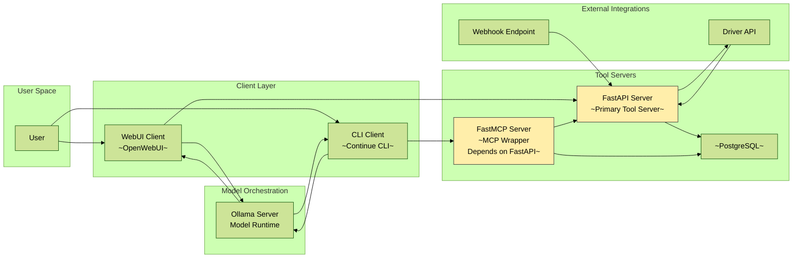
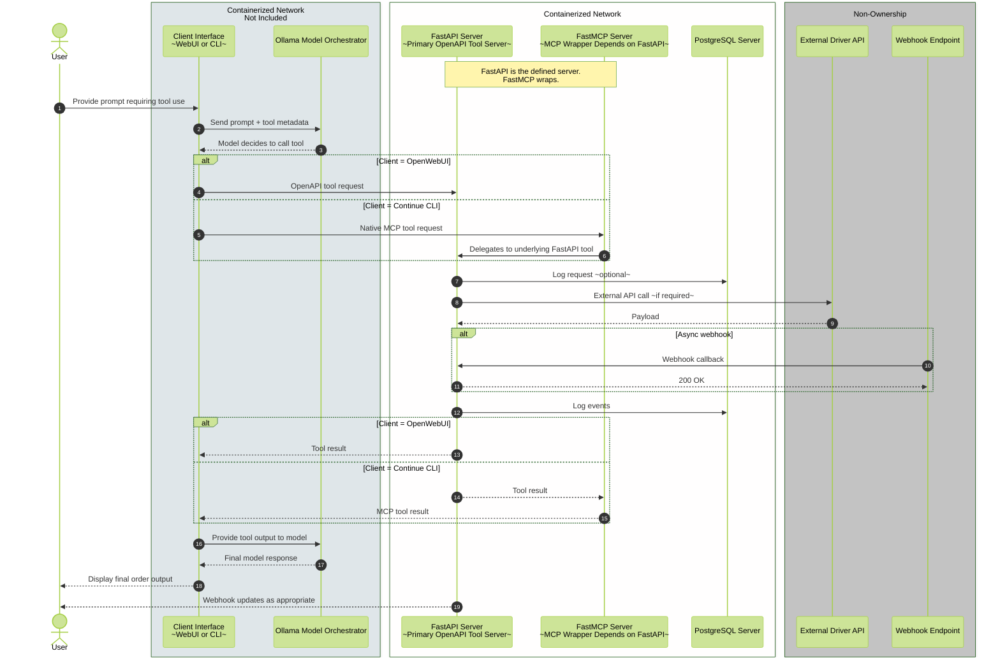

# Contexts

Architectural Context Overview

```mermaid
---
config:
  theme: forest
---

flowchart LR

    subgraph UserSpace[User Space]
        U[User]
    end

    subgraph ClientLayer[Client Layer]
        W[WebUI Client<br/>~OpenWebUI~]
        C[CLI Client<br/>~Continue CLI~]
    end

    subgraph Orchestration[Model Orchestration]
        O[Ollama Server<br/>Model Runtime]
    end

    subgraph Tooling[Tool Servers]
        A[FastAPI Server<br/>~Primary Tool Server~]:::servers
        M[FastMCP Server<br/>~MCP Wrapper<br/>Depends on FastAPI~]:::servers
        DB[~PostgreSQL~]
    end

    subgraph External[External Integrations]
        D[Driver API]
        H[Webhook Endpoint]
    end

    %% User entry
    U --> W
    U --> C

    %% Clients to orchestrator
    W --> O
    C --> O

    %% Orchestrator to tool servers
    O --> W
    O --> C

    %% Client routing
    W --> A
    C --> M

    %% Dependency direction
    M --> A

    %% Tool server interactions
    A --> DB
    M --> DB
    A --> D
    D --> A
    H --> A

    classDef servers fill:#fea,color:#000,stroke:#333;

```

Usage Contexts : CLI + WebUI Agent Tool

```mermaid
---
config:
  theme: forest
---

sequenceDiagram
    autonumber
    actor User as User
    box rgba(223, 230, 233, 1) Containerized Network<br/>Not Included
        participant Client as Client Interface<br/>~WebUI or CLI~
        participant Orchestrator as Ollama Model Orchestrator
    end 
    box rgba(255, 254, 254, 1)Containerized Network
        participant FastAPI as FastAPI Server<br/>~Primary OpenAPI Tool Server~
        participant FastMCP as FastMCP Server<br/>~MCP Wrapper Depends on FastAPI~
        participant DB as PostgreSQL Server
    end
    box rgba(195, 195, 195, 1) Non-Ownership
    participant DriverAPI as External Driver API
    participant Webhook as Webhook Endpoint
    end

    Note over FastAPI, FastMCP: FastAPI is the defined server.<br/>FastMCP wraps.

    User->>Client: Provide prompt requiring tool use
    Client->>Orchestrator: Send prompt + tool metadata
    Orchestrator-->>Client: Model decides to call tool

    %% alt Tool call triggered
        %% Client routing logic
        alt Client = OpenWebUI
            Client->>FastAPI: OpenAPI tool request
        else Client = Continue CLI
            Client->>FastMCP: Native MCP tool request
            FastMCP->>FastAPI: Delegates to underlying FastAPI tool
        end

        FastAPI->>DB: Log request ~optional~

        %% External API
        FastAPI->>DriverAPI: External API call ~if required~
        DriverAPI-->>FastAPI: Payload

        alt Async webhook
            Webhook->>FastAPI: Webhook callback
            FastAPI-->>Webhook: 200 OK
        end

        FastAPI->>DB: Log events

        %% Return path
        alt Client = OpenWebUI
            FastAPI-->>Client: Tool result
        else Client = Continue CLI
            FastAPI-->>FastMCP: Tool result
            FastMCP-->>Client: MCP tool result
        end

        Client->>Orchestrator: Provide tool output to model
        Orchestrator-->>Client: Final model response
    %% end

    Client-->>User: Display final order output
    FastAPI-->>User: Webhook updates as appropriate

```

